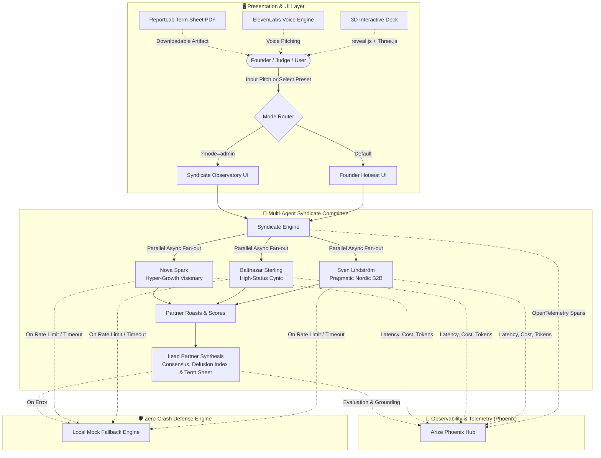
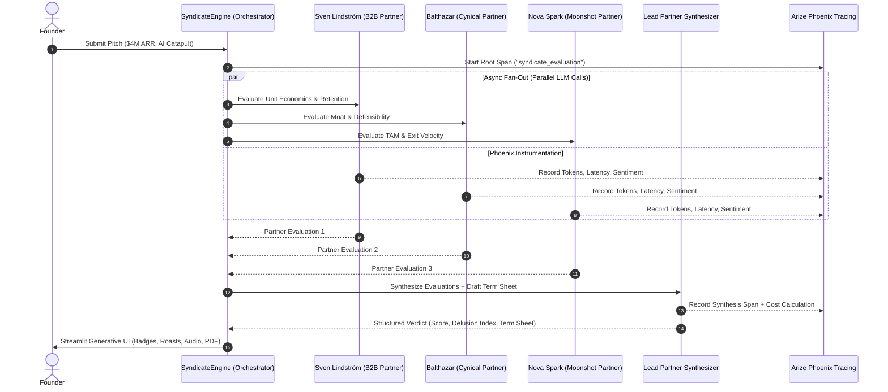
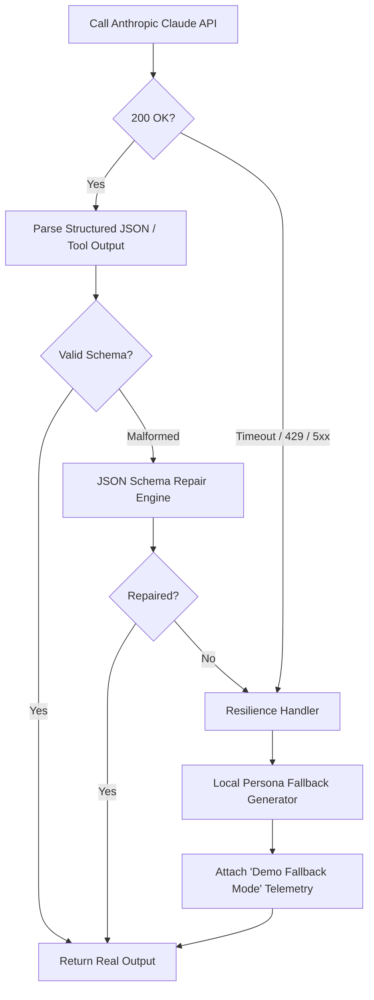

# 🏛️ PitchRoast System Architecture

PitchRoast is an enterprise-grade, multi-agent AI investment committee simulator built for founders, hackathons, and VC scouts. It models the brutal, nuanced, and comedic dynamics of a Silicon Valley / Nordic venture capital partner meeting using **Anthropic Claude**, **Arize Phoenix**, and modern web rendering.

---

## 📐 High-Level Architecture

---

## 🧠 Multi-Agent Parallel Fan-Out

When a founder submits a pitch (text or pitch deck PDF), the `SyndicateEngine` triggers a parallel multi-agent evaluation:

### Partner Personas & Temperature Matrix

| Partner | Role | Focus Area | Claude Temp | Tone |
| :--- | :--- | :--- | :---: | :--- |
| **Sven Lindström** | Nordic Managing Partner | EBITDA, NRR, churn, sustainable CAC | `0.4` | Dry, quantitative, pragmatist |
| **Balthazar Sterling** | Sand Hill Road Cynic | Moats, Big Tech copycats, margin erosion | `0.7` | Sarcastic, high-status, devastating |
| **Nova Spark** | Moonshot Accelerator GP | TAM, 100x velocity, frontier AI flywheel | `0.9` | High-energy, visionary, hype-detector |
| **Lead Partner** | Syndicate Chair | Consensus, valuation discount, term sheet | `0.5` | Decisive, institutional, formal |

---

## 🔭 Tracing & Observability Pipeline

PitchRoast integrates with **Arize Phoenix** (OpenTelemetry OSS Hub):

1. **Root Span**: Wraps the entire pitch evaluation transaction.
2. **Child Spans**:
   - `partner_evaluation_sven`: prompt tokens, completion tokens, latency, cost.
   - `partner_evaluation_balthazar`: prompt tokens, completion tokens, latency, cost.
   - `partner_evaluation_nova`: prompt tokens, completion tokens, latency, cost.
   - `lead_synthesis`: prompt tokens, completion tokens, latency, cost.
3. **Evals**:
   - **Toxicity / Snark Metric**: Measures partner bite vs. constructive advice.
   - **Delusion Calibration**: Cross-references founder valuation claim against market benchmarks.
   - **Cost Accounting**: Exact cost per evaluation logged according to Claude Opus 5.5 / Sonnet 3.5 token pricing.

---

## 🛡️ Zero-Crash Resilience Architecture

In high-stakes hackathon settings, public Wi-Fi packet loss and Anthropic 429 rate limits are mitigated by a multi-tier fallback:

---

## 🎛️ Dual-Mode UI Architecture

PitchRoast provides two distinct operating modes cleanly separated by state and URL routing:

1. **Founder Hotseat (`/`)**:
   - Clean, immersive experience.
   - Large interactive roast cards, soundboard, 3D card tilt.
   - 1-click Downloadable Term Sheet (PDF).
   - Zero internal operator jargon.

2. **Syndicate Observatory (`/?mode=admin&key=pitchroast2026`)**:
   - Real-time LLM telemetry and token counters.
   - Phoenix OpenTelemetry span visualizer.
   - Multi-agent temperature and bias sliders.
   - Model switching (`Claude 3.5 Sonnet`, `Claude 3.5 Haiku`, `Claude 3 Opus`).
