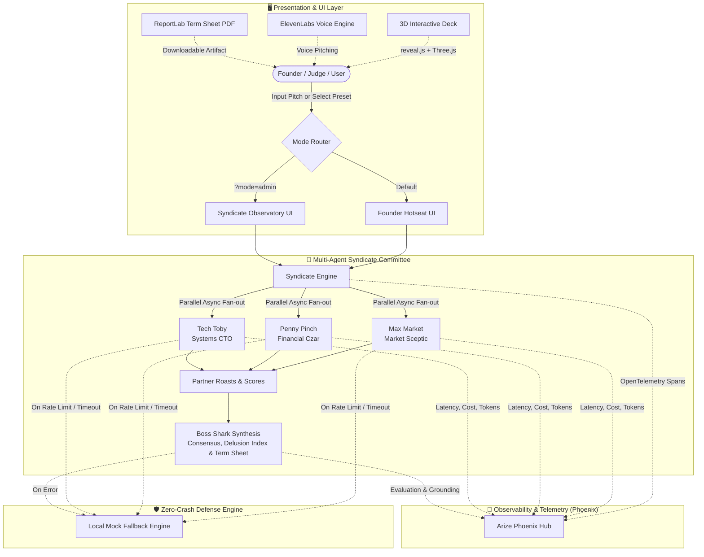
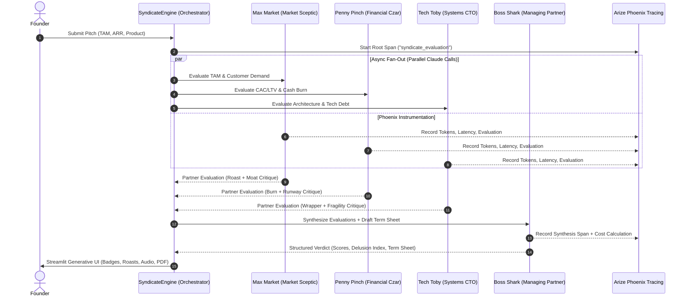
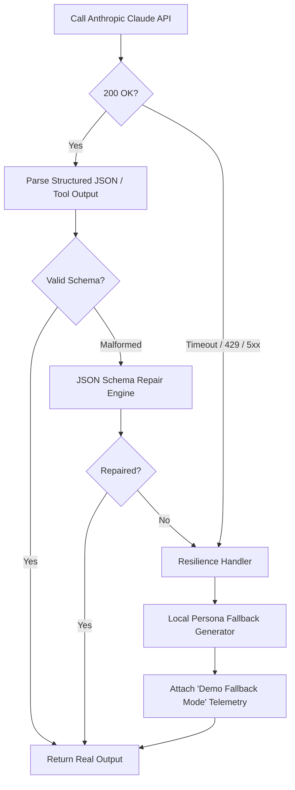

# 🏛️ PitchRoast System Architecture

PitchRoast is an enterprise-grade, multi-agent AI investment committee simulator built for founders, hackathons, and VC scouts. It models the brutal, nuanced, and comedic dynamics of a Silicon Valley / Nordic venture capital partner meeting using **Anthropic Claude**, **Arize Phoenix**, and modern web rendering.

---

## 📐 High-Level Architecture

---

## 🧠 Multi-Agent Parallel Fan-Out

When a founder submits a pitch (text or pitch deck preset), the `SyndicateEngine` triggers a parallel multi-agent evaluation:

### Partner Personas & Focus Matrix

| Partner | Role | Focus Domain | Architectural Focus |
| :--- | :--- | :--- | :--- |
| **Max Market** | The Market Sceptic | TAM, customer demand, buzzwords | Exposes fake demand, inflated TAM, and unvalidated claims |
| **Penny Pinch** | The Financial Czar | Unit economics, CAC/LTV, cash burn | Deconstructs negative margins, runaway burn, and pricing traps |
| **Tech Toby** | The Systems CTO | Architecture, wrappers, technical debt | Evaluates API fragility, duct-tape code, and AI wrapper risk |
| **Boss Shark** | Managing Partner | Consensus, valuation, term sheet | Synthesizes committee debate, issues covenants & 1% Pivot |

---

## 🔭 Tracing & Observability Pipeline

PitchRoast integrates with **Arize Phoenix** (OpenTelemetry OSS Hub):

1. **Root Span**: Wraps the entire pitch evaluation transaction (`syndicate_evaluation`).
2. **Child Spans**:
   - `partner_evaluation_marc`: prompt tokens, completion tokens, latency, cost.
   - `partner_evaluation_karen`: prompt tokens, completion tokens, latency, cost.
   - `partner_evaluation_torvalds`: prompt tokens, completion tokens, latency, cost.
   - `lead_synthesis_gekko`: prompt tokens, completion tokens, latency, cost.
3. **Evals**:
   - **Toxicity / Snark Metric**: Measures partner bite vs. constructive advice.
   - **Delusion Calibration**: Cross-references founder valuation claim against market benchmarks.
   - **Cost Accounting**: Exact cost per evaluation logged according to Claude Opus 5.5 / Sonnet 3.5 token pricing.

---

## 🛡️ Zero-Crash Resilience Architecture

In high-stakes hackathon settings, public Wi-Fi packet loss and Anthropic 429 rate limits are mitigated by a multi-tier fallback:

---

## 🎛️ Dual-Mode UI Architecture

PitchRoast provides two distinct operating modes cleanly separated by state and URL routing:

1. **Founder Hotseat (`/`)**:
   - Clean, immersive experience.
   - Large interactive roast cards, soundboard, 3D card tilt.
   - 1-click Downloadable Term Sheet (PDF).
   - Zero internal operator jargon.

2. **Syndicate Observatory (`/?mode=admin&key=pitchroast2026`)**:
   - Real-time LLM telemetry and token counters.
   - Phoenix OpenTelemetry span visualizer.
   - Multi-agent temperature and bias sliders.
   - Model switching (`Claude 3.5 Sonnet`, `Claude 3.5 Haiku`, `Claude 3 Opus`).
