# 📄 Product Requirements Document (PRD) — PitchRoast 🔥

**Document Status**: Approved · v1.0.0  
**Target Event**: Claude Community Stockholm Build Day (Track 1: Delight)  
**Author / Product Lead**: Akkireddy Challa  
**Repository**: [github.com/akkireddy-challa/pitchroast](https://github.com/akkireddy-challa/pitchroast)

---

## 1. Executive Summary & Problem Statement

### The Problem
First-time founders and hackathon participants pitch early concepts to mentors, angel investors, and colleagues. In 95% of cases, founders receive polite social pleasantries (*"Sounds super cool, keep in touch!"*) rather than candid, actionable critique. This false positive feedback leads to wasted months building unviable products with broken unit economics, zero defensibility, and excessive cash burn.

### The Solution: PitchRoast
**PitchRoast** is an autonomous multi-agent venture investment committee that delivers the unfiltered, comedic, and mathematically grounded truth no VC says to your face. In under 15 seconds, a syndicate of specialized Claude-powered AI partners critiques the pitch across market sizing, unit economics, tech debt, and investment readiness—culminating in an animated scorecard, a stamped satirical term sheet, and a 1-page PDF deliverable.

---

## 2. Target Personas & User Journeys

| Persona | Needs & Motivations | Core Feature Touchpoint |
| :--- | :--- | :--- |
| **Early-Stage Founder** | Wants quick, unvarnished stress-testing of pitch before meeting real VCs; needs laughs + actionable pivots. | **Founder Hotseat**: Quick presets, 1-click committee convening, stamped PDF term sheet download. |
| **Hackathon Judge / Tech Lead** | Wants to inspect multi-agent orchestration, token telemetry, latency, and OTEL span trees. | **Syndicate Observatory**: Arize Phoenix telemetry, model parameter tuning, credit tracking. |
| **Accelerator Director / Scout** | Wants to batch-evaluate cohort pitches and identify red flags in business models. | **ReportLab PDF Exporter**: Exportable term sheets and executive summaries. |

---

## 3. Functional Requirements (FR)

### FR-1: Input Ingestion & Presets
- **FR-1.1**: Accept free-form text pitch submissions (elevator pitches, executive summaries, or bullet points).
- **FR-1.2**: Provide 1-click curated presets mocking realistic Nordic/Silicon Valley startup archetypes (`☕ FikaSync Compliance`, `💳 Klarna for Regret`, `🤖 AI Standup Bot`, `🥛 Oat Milk Web3`).
- **FR-1.3**: Support downloadable sample 1-page pitch decks for each preset.

### FR-2: Multi-Agent Parallel Fan-Out (Boardroom Deliberation)
- **FR-2.1**: Concurrently trigger 3 distinct partner agents using ThreadPoolExecutor to minimize end-to-end latency:
  - **Max Market** (The Market Sceptic): Focus on TAM delusions, customer demand, and buzzword inflation.
  - **Penny Pinch** (The Financial Czar): Focus on unit economics, CAC/LTV divergence, and runaway cash burn.
  - **Tech Toby** (The Systems CTO): Focus on tech stack defensibility, AI wrappers, and architecture debt.
- **FR-2.2**: Partner Recusal: Allow users or operators to deselect partners to reduce API cost.

### FR-3: Lead Partner Synthesis & Contract Generation
- **FR-3.1**: The Syndicate Chair receives all partner outputs and generates:
  - Quantitative Scores: Delusion Index (%), True Moat Score (0-10), Runway (Months), Pre-Money Valuation.
  - Final Verdict: "Funded (Predatory Terms)" or "Rejected with Extreme Prejudice".
  - Satirical Term Sheet: Mandatory humorous covenants (e.g. founder equity haircut, mandatory CEO cold plunge).
  - The 1% Pivot: A single pragmatic, high-revenue business model pivot.

### FR-4: Presentation & Audio Deliverables
- **FR-4.1**: 3D Presentation Deck: Built with Reveal.js + Three.js dynamic particle constellation.
- **FR-4.2**: ElevenLabs Narration: Integrated voice clone and audio playback for stage pitches.
- **FR-4.3**: PDF Term Sheet Generation: Downloadable stamped PDF created via ReportLab.

### FR-5: Telemetry, Observability & Cost Accounting
- **FR-5.1**: Instrument full OpenTelemetry spans to local Arize Phoenix OSS server (`localhost:6006`).
- **FR-5.2**: Log token consumption (prompt tokens, completion tokens, cached tokens).
- **FR-5.3**: Real-time EUR balance tracking against the €100 hackathon voucher.

### FR-6: Zero-Crash Demo Defense
- **FR-6.1**: Intercept all API timeouts, rate limits (HTTP 429), or missing keys.
- **FR-6.2**: Automatically fallback to deterministic, high-quality mocked deliberations.
- **FR-6.3**: Surface subtle operator indicator without breaking the frontend experience.

---

## 4. Non-Functional Requirements (NFR)

- **Performance**: Parallel fan-out response time $\le 15$ seconds under standard API conditions.
- **Reliability**: 100% demo uptime via fallback engine (zero unhandled exceptions shown to user).
- **Security**: API keys stored strictly in environment or write-only session state; never rendered in HTML or logs.
- **Accessibility & UX**: Dark glassmorphic design, WCAG-compliant contrast ratios, and `prefers-reduced-motion` CSS overrides.

---

## 5. Product Evolution & Future Roadmap

```mermaid
flowchart LR
    subgraph Phase1 ["Phase 1: MVP (Shipped)"]
        P1A[Parallel 4-Agent Syndicate]
        P1B[Streamlit Dual-Mode UI]
        P1C[Phoenix Tracing & PDF]
        P1D[3D Deck + ElevenLabs]
    end

    subgraph Phase2 ["Phase 2: Realtime Voice (v1.1)"]
        P2A[WebRTC Live Audio]
        P2B[Real-time Voice Interruption]
        P2C[Custom Persona Marketplace]
    end

    subgraph Phase3 ["Phase 3: Multimodal Vision (v1.2)"]
        P3A[PDF Slide-by-Slide Vision]
        P3B[Cap Table Dilution Calculator]
        P3C[Notion / Slack Integration]
    end

    subgraph Phase4 ["Phase 4: Global Syndicate (v2.0)"]
        P4A[Multiplayer Pitch Tournaments]
        P4B[Audience Live Delusion Voting]
        P4C[Self-Hosted Docker Stack]
    end

    Phase1 --> Phase2 --> Phase3 --> Phase4
```

### Detailed Evolution Milestones

1. **v1.1 (Realtime Voice Interruption)**:
   - WebRTC streaming voice interface allowing founders to speak directly into their microphone.
   - Claude and ElevenLabs streaming audio enable the AI VCs to interrupt the founder mid-sentence when a buzzword or impossible financial metric is detected.

2. **v1.2 (Multimodal Pitch Deck Vision Analysis)**:
   - Drag-and-drop 10-slide PDF pitch decks into Claude 3.5 Sonnet's vision pipeline.
   - Partner agents visually critique bad font choices, misleading hockey-stick charts, and over-crowded architecture diagrams.

3. **v2.0 (Multiplayer Syndicate & Accelerator Suite)**:
   - Cohort pitch days for incubators (Y Combinator, Antler, Sting, Epicenter).
   - Real-time audience emoji reactions and crowd-sourced Delusion Index voting.
