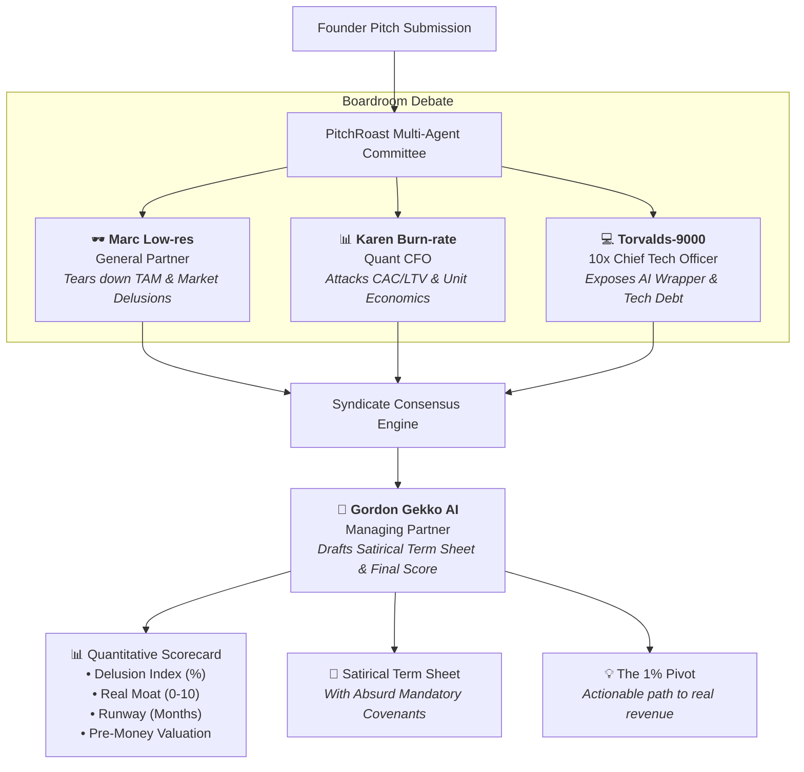

# PitchRoast 🔥 — The Autonomous Venture Syndicate

[](https://console.anthropic.com)
[](https://luma.com/claudecommunity)
[](#)
[](#)

> *"An autonomous venture committee of 4 ruthless AI partners who debate, dismantle, and deliver the brutal truth no VC says to your face—complete with live agent banter and a satirical term sheet."*

---

## ⚡ The Concept

Every founder has pitched an investor and received the standard diplomatic reply: *"Great deck, let's keep in touch!"* 

In Silicon Valley and Nordic startup hubs, that's code for: *"Your unit economics are broken and a college student could build your product this weekend."*

**PitchRoast eliminates polite lies.** It convenes a four-partner investment committee that analyzes your startup pitch in parallel, computes quantitative risk metrics, debates your business model in real time, and drafts an absurd satirical term sheet.

---

## 🏛️ Autonomous Agent Syndicate

PitchRoast orchestrates four distinct Claude-powered agents into a cohesive investment committee:



### The Committee Partners

| Agent | Persona & Title | Focus Area |
| :--- | :--- | :--- |
| **🕶️ Marc Low-res** | General Partner | Dismantles market size assumptions, calls out buzzword soup, and mocks lack of a genuine moat. |
| **📊 Karen Burn-rate** | Quant Chief Financial Officer | Destroys negative gross margins, CAC > LTV, cloud burn, and the inevitable down-round. |
| **💻 Torvalds-9000** | 10x Systems CTO | Flags "OpenAI API wrapper" architecture, tech debt, and single-point-of-failure vulnerabilities. |
| **🦈 Gordon Gekko AI** | Syndicate Shark | Delivers the committee's final quantitative scores, valuation haircut, and non-negotiable clauses. |

---

## 📊 Live Scoring Engine

PitchRoast computes four quantitative indicators for every submission:
* **Delusion Index (%)**: How far the founder's assumptions diverge from reality.
* **True Moat Score (0–10)**: Resistance to being cloned by an intern in 48 hours.
* **Survival Runway (Months)**: Estimated time before emergency bridge loan or insolvency.
* **Pre-Money Valuation**: A realistic market assessment (e.g. *"$14.50 and a lukewarm kanelbulle"*).

---

## 🚀 Quickstart

### 1. Clone & Enter Directory
```zsh
git clone https://github.com/your-username/pitchroast.git
cd pitchroast
```

### 2. Activate Virtual Environment
```zsh
source .venv/bin/activate
```

### 3. Add Your Anthropic Key
```zsh
./set_key.sh sk-ant-your-key-here
```
*(Or export `ANTHROPIC_API_KEY="sk-ant-..."`)*

### 4. Launch the Interactive Boardroom
```zsh
streamlit run app.py
```
Open **`http://localhost:8501`** in your browser.

---

## 🎤 2-Minute Demo Presentation Script

Designed specifically for the 20:30 presentation at Epicenter:

1. **The Hook (0:00 - 0:25)**:
   > *"Every founder in this room has pitched an investor and heard: 'Great deck, let's keep in touch!' That’s VC code for: 'This makes zero sense.' We built PitchRoast to eliminate polite lies."*
2. **The Live Demo (0:25 - 1:25)**:
   > *Select one of the built-in presets (e.g., 'Autonomous Oat Milk Micro-Roastery with Web3 Proof-of-Foam').*  
   > *Click 'Convene Committee'. Watch the three partners debate and read aloud Marc's market roast, Karen's financial reality check, and the satirical term sheet clauses.*
3. **The Tech (1:25 - 1:45)**:
   > *Explain the multi-agent committee architecture, structured JSON consensus schema, and instant real-time generation powered by Anthropic's frontier Claude models.*
4. **The Closing Punchline (1:45 - 2:00)**:
   > *"PitchRoast: The honest venture capital firm that costs \$0 instead of 20% of your equity. Thank you!"*

---

## 🛠️ Tech Stack
* **Language & Runtime**: Python 3.12+ / 3.14 (Mise, uv)
* **Frontend**: Streamlit 1.64 (Custom Dark Glassmorphism CSS)
* **AI Orchestration**: Anthropic Python SDK (`claude-3-5-sonnet`, `claude-opus-5-5`, `claude-fable-5-1`)
* **Linter & Standards**: Ruff 0.16
