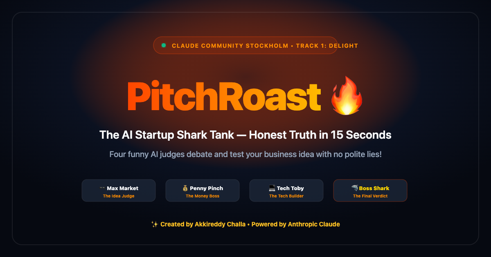
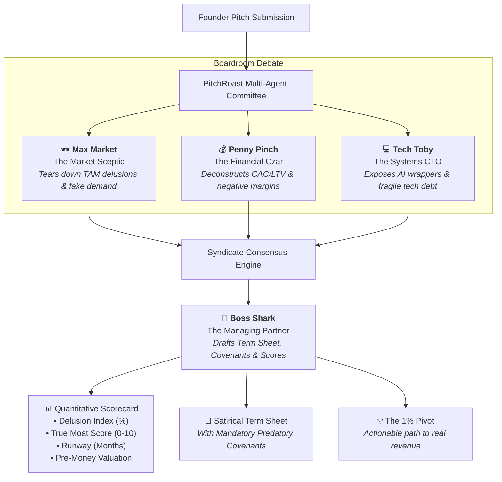

# PitchRoast 🔥 — The Autonomous Venture Syndicate

[](https://github.com/akkireddy-challa)
[](https://www.linkedin.com/in/akkireddy-challa/)
[](https://console.anthropic.com)
[](https://github.com/Arize-ai/phoenix)
[](https://luma.com/claudecommunity)
[](#)
[](https://akkireddy-challa.github.io/pitchroast/)
[](https://akkireddy-challa-pitchroast-app-cwyolp.streamlit.app/)
[](CONTRIBUTING.md)
[](https://github.com/astral-sh/ruff)
[](LICENSE)

> **Created by Akkireddy Challa** for the **Stockholm | Fable 5.1 x Opus 5.5 Build Day** (Track 1: Delight). Presented by **Claude Community Stockholm**.  
> *"An autonomous venture committee of 4 ruthless AI partners who debate, dismantle, and deliver the brutal truth no VC says to your face—complete with live agent banter and a satirical term sheet."*

---

<p align="center">
  
</p>

## ⚡ The Concept: Why PitchRoast Exists

Every founder has pitched an investor and received the standard diplomatic reply: *"Great deck, let's keep in touch!"* 

In Silicon Valley and Nordic startup ecosystems, that is polite code for: *"Your unit economics are broken and a college student could build your product this weekend."*

**PitchRoast eliminates polite lies.** Early-stage founders frequently suffer from false validation: friends, colleagues, and early angel investors hesitate to deliver blunt, critical feedback. This leads to wasted runway, misguided product roadmaps, and months spent pursuing non-existent market demand.

PitchRoast convenes an autonomous, four-partner venture capital investment committee powered by **Anthropic Claude** (Opus 5.5 & Fable 5.1). Operating in parallel, the syndicate dissects your pitch across market sizing, cash burn, technical defensibility, and strategic viability—delivering an animated scorecard, a stamped satirical term sheet, and an actionable "1% Pivot" in under 15 seconds.

---

## 🏛️ Autonomous Agent Syndicate

PitchRoast orchestrates four distinct Claude-powered agents into a cohesive investment committee:



### The Committee Judges

| Agent | Persona & Title | Focus Domain | Architectural Role |
| :--- | :--- | :--- | :--- |
| **🕶️ Max Market** | The Market Sceptic | TAM delusions, non-existent customer demand, buzzword inflation | Attacks founder assumptions and lack of product-market fit |
| **💰 Penny Pinch** | The Financial Czar | CAC > LTV divergence, runaway cash burn, negative gross margins | Dissects pricing traps, cloud bills, and insolvency timelines |
| **💻 Tech Toby** | The Systems CTO | Fragile AI wrappers, duct-tape architecture, commoditized APIs | Tests technical defensibility and codebase longevity |
| **🦈 Boss Shark** | The Managing Partner | Syndicate consensus, term sheet drafting, valuation discount | Synthesizes committee debate and issues binding covenants |

---

## 📊 Live Scoring Engine

PitchRoast computes four quantitative indicators for every submission:
* **Delusion Index (%)**: How far the founder's assumptions diverge from reality.
* **True Moat Score (0–10)**: Resistance to being cloned by an intern in 48 hours.
* **Survival Runway (Months)**: Estimated time before emergency bridge loan or insolvency.
* **Pre-Money Valuation**: A realistic market assessment (e.g. *"$14.50 and a lukewarm kanelbulle"*).

---

## 🌐 Live Deployments

| Component | Description | URL |
| :--- | :--- | :--- |
| 🎯 **Founder Hot Seat (Live App)** | Public interactive boardroom for live audience pitches & PDF downloads | **[akkireddy-challa-pitchroast-app-cwyolp.streamlit.app](https://akkireddy-challa-pitchroast-app-cwyolp.streamlit.app/)** |
| 📽️ **Interactive 3D Pitch Deck** | Modern 3D animations + ElevenLabs AI voice narrated presentation | **[akkireddy-challa.github.io/pitchroast](https://akkireddy-challa.github.io/pitchroast/)** |
| 🔬 **Syndicate Observatory** | Internal operator command centre (Passkey: `pitchroast2026`) | **[Observatory Direct Access](https://akkireddy-challa-pitchroast-app-cwyolp.streamlit.app/?mode=admin&key=pitchroast2026)** |

---

## 🎨 Modern 3D Visuals & Executive PDF Engine

PitchRoast combines modern aesthetic presentation with executive deliverables:
- **Interactive 3D Depth & Particle Mesh**: The presentation deck features a real-time 3D geometric particle constellation and glowing ember field with dynamic camera parallax responding to mouse movement.
- **3D Card Tilt with Specular Glare**: Interactive cards tilt smoothly in 3D perspective (`transform: perspective(900px) rotateX(...) rotateY(...) translateZ(8px)`) with moving specular light sheens.
- **Executive PDF Term Sheets**: Founders can download formal, stamped investment committee verdicts as styled PDFs (`fpdf2`), complete with valuation, covenants, quantitative scorecards, and the 1% pivot.
- **Sample Pitch Deck One-Pagers (PDF)**: Includes downloadable 1-page sample pitch decks for Swedish presets (`☕ FikaSync Compliance`, `💳 Klarna for Regret`, `🤖 AI Standup Bot`, `☕ Oat Milk Web3`) right from the deck and live app.
- **ElevenLabs High-Fidelity Audio**: Autonomous slide narration voiced by ElevenLabs' premier model (**Brian**), perfectly timed for a crisp 68-second pitch.

---

## 🛡️ Zero-Crash Demo Resilience Mode

Hackathon Wi-Fi drops and expired API keys frequently crash live demos on stage. **PitchRoast is engineered for 100% demo uptime**:
- **Automatic Fallback**: If an Anthropic API key is expired, unconfigured, or hits rate limits, the engine gracefully activates the **Zero-Crash Simulation Engine**.
- **Realistic Deliberations**: All 4 partners debate with bespoke, razor-sharp satirical critiques tailored to Swedish tech culture (`☕ FikaSync`, `💳 Klarna for Regret`, `🤖 AI Standup Bot`, `☕ Oat Milk Web3`) and arbitrary audience pitches.
- **Zero Interruption**: Live audience testing and stage demonstrations never fail or show raw error screens.
- **Instant Live Claude Upgrade**: When a valid Claude API key is supplied (in Streamlit Secrets, environment, or the Observatory), live `claude-opus-5-5` and `claude-fable-5-1` take over immediately.

---

## 🚀 Quickstart

### 1. Clone & Enter Directory
```zsh
git clone https://github.com/akkireddy-challa/pitchroast.git
cd pitchroast
```

### 2. Activate Virtual Environment
```zsh
source .venv/bin/activate
# Or create fresh with uv:
uv sync
```

### 3. Configure Your Anthropic Key (Optional)
```zsh
./set_key.sh sk-ant-your-key-here
```
*(If omitted, PitchRoast boots directly in Zero-Crash Resilience Mode with full interactive roasts!)*

### 4. Launch the Interactive Boardroom
```zsh
streamlit run app.py
```
Open **`http://localhost:8501`** in your browser. `app.py` is the only runnable
entrypoint; every other module is imported by it.

### Two doors into the same session

| URL | View | Audience |
| --- | --- | --- |
| `http://localhost:8501/` or `?mode=founder` | 🎯 **Founder Hot Seat** | Founders. Quick pitches, presets (FikaSync, Klarna for Regret), a VC-mood dial, the committee roster, the scorecard and the stamped term sheet. Frictionless and public. |
| `http://localhost:8501/?mode=admin` | 🔬 **Syndicate Observatory** | Judges and operators. PIN-protected (`pitchroast2026`). Phoenix trace hub, token/credit telemetry against the €100 voucher, model + effort orchestration, panel concurrency, and deliberation traces. |

The switch sits at the top right of either view and rewrites the URL, so both
links are shareable. **The two views share one session**: run a pitch in the Hot
Seat, flip to the Observatory, and the same verdict is there with its traces and
token economics — flipping never costs an API call.

The split is a UX boundary, not an authorisation one. Anyone can type
`?mode=admin`; the Observatory only ever shows local, non-secret operational
data, and the API key field is write-only.

**Seating the panel.** The Observatory's *Partner seats* control decides who
reviews the pitch: drop a partner to skip that line of attack and its API call.
One seat means two calls per roast instead of four. The managing partner is not
optional — it synthesises whoever sat and issues the term sheet.

**Credit telemetry.** The voucher tracker counts only roasts run in this app, at
list price, with no cache discount. `claude-opus-5-5` has no published
per-token rate, so it is charged at the Opus tier and labelled as an assumption;
set `PITCHROAST_PRICING` once you have confirmed the real number in the Console.

### Module map

| File | Role |
| --- | --- |
| `app.py` | Router, page shell, mode switch |
| `founder.py` / `admin.py` | The two views |
| `board.py` | Verdict rendering + the live run, shared by both |
| `state.py` | Session state, operator settings, Phoenix bootstrap |
| `costs.py` | Token → credit arithmetic |
| `syndicate.py` / `observability.py` / `ui.py` | Engine, tracing, components |

---

## 🎤 Stage Presentation Options

### Option A: 🤖 Autonomous AI Clone Mode (Zero Stage Fright!)
You don't need to speak or worry about public speaking! The presentation deck features an autonomous audio voiceover powered by the AI Clone of Akkireddy:

1. **Akkireddy's 5-Second Intro at the Mic**:
   > *"Good evening Claude Community Stockholm! In the spirit of autonomous AI agents, why have a tired human pitch on stage when you can have an AI clone do it? Please welcome: my digital AI clone."*
2. **Press `P` on the keyboard (or click `🎙️ Let AI Pitch`)**:
   - The AI Clone introduces itself:
     > *"Hello Claude Community Stockholm! I am the AI clone of human Akkireddy Challa. My human original built this entire project tonight for the Claude Community Fable 5.1 x Opus 5.5 Build Day. But why have a tired human pitch on stage when you can have a superior AI clone do it with zero stage fright? Welcome to PitchRoast! Let's see why your business idea is probably terrible."*
   - The AI narrates all 8 slides with live sound waves and real-time subtitles, automatically advancing smoothly from slide to slide!

---

### Option B: 🎙️ Live Stage Pitch (2-Minute Script)
If you are presenting live on stage, here is the high-impact script:

1. **The Hook (0:00 - 0:25)**:
   > *"Every founder has pitched an angel investor and received the standard polite reply: 'Great deck, let's keep in touch!' But in venture capital, that’s code for: 'Your unit economics are broken and an intern could clone this over the weekend.' Founders burn months of runway chasing false positive signals. We built PitchRoast to eliminate polite lies and deliver unfiltered, mathematically grounded critique in 15 seconds."*

2. **The Autonomous Syndicate (0:25 - 0:45)**:
   > *"PitchRoast orchestrates four specialized Claude-powered agents into a parallel investment committee:  
   > • Max Market attacks TAM delusions and imaginary customer demand.  
   > • Penny Pinch tears apart negative unit economics and runaway cash burn.  
   > • Tech Toby exposes fragile AI wrappers and infrastructure debt.  
   > • And Boss Shark synthesizes the debate to issue a stamped, satirical term sheet with actionable pivot advice."*

3. **Live Demonstration (0:45 - 1:25)**:
   > *(Select a preset such as 'Klarna for Regret' or input a live audience pitch and click 'Convene Committee')*  
   > *"In under 15 seconds, all three partners deliberate concurrently. Notice the animated scorecards: Delusion Index, True Moat Score, and estimated Runway. Boss Shark issues a predatory term sheet—complete with mandatory covenants and an exportable ReportLab PDF."*

4. **Architecture & Wrap-Up (1:25 - 1:45)**:
   > *"Under the hood, we run Anthropic Claude Opus 5.5 and Fable 5.1 with OpenTelemetry instrumentation into Arize Phoenix, tracking token latency and costs in real time. We also engineered a deterministic zero-crash fallback engine so the demo never fails on stage. PitchRoast: Honest VC feedback in 15 seconds. Thank you!"*

---

## 🛠️ Tech Stack
* **Language & Runtime**: Python 3.12+ / 3.14 (Mise, uv)
* **Frontend**: Streamlit 1.64 (Custom Dark Glassmorphism CSS & 3D tilt) + HTML5 3D WebGL/Canvas Presentation Deck
* **AI Orchestration**: Anthropic Python SDK (`claude-fable-5-1`, `claude-opus-5-5`, `claude-opus-5`)
* **Voice Narration**: ElevenLabs Premier Audio (`brian` model)
* **PDF Engine**: `fpdf2` (Dynamic executive term sheets & 1-pager pitch deck PDFs)
* **Observability & Tracing**: Arize Phoenix OSS (OpenInference / OpenTelemetry native spans, token metrics, and latency tracking)
* **Linter & Standards**: Ruff 0.16

---

## 🏛️ Open Source Architecture & Community Lifecycle

PitchRoast adheres to authentic open-source engineering standards with transparent architecture, comprehensive testing, and welcoming community guidelines:

| Document | Description |
| :--- | :--- |
| 📄 **[PRD.md](PRD.md)** | Product Requirements Document: Problem statement, user personas, functional specifications (FR-1 to FR-6), and evolution roadmap. |
| 📐 **[ARCHITECTURE.md](ARCHITECTURE.md)** | Multi-agent parallel fan-out design, OpenTelemetry tracing schema, zero-crash state machine, and dual-mode routing. |
| 🗺️ **[ROADMAP.md](ROADMAP.md)** | Product milestones: Realtime WebRTC voice interruptions (v1.1), multimodal vision deck critique (v1.2), and multiplayer syndicate tournament (v2.0). |
| 🤝 **[CONTRIBUTING.md](CONTRIBUTING.md)** | Developer onboarding guide, local environment setup with `uv`, pre-commit hooks, and instructions for contributing new VC personas. |
| 📋 **[CHANGELOG.md](CHANGELOG.md)** | Semantic versioning release log following the Keep a Changelog format. |
| ⚖️ **[CODE_OF_CONDUCT.md](CODE_OF_CONDUCT.md)** | Contributor Covenant v2.1 community health standard. |
| 🔒 **[SECURITY.md](SECURITY.md)** | Vulnerability reporting policy and API credential safety guidelines. |
| 📄 **[LICENSE](LICENSE)** | Standard permissive MIT License attributed to Akkireddy Challa. |

### 🛠️ Developer Commands (`Makefile`)
```zsh
make install    # Create .venv and install all dependencies with uv
make app        # Launch the Streamlit boardroom UI
make test       # Run all offline test suites (modes, syndicate, ui, obs)
make check      # Run Ruff linter and formatter
make demo       # Run the CLI multi-agent committee demo
make eval       # Evaluate LLM roasts in Arize Phoenix
```

---

## 📄 License & Attribution

Distributed under the **MIT License**. See [LICENSE](LICENSE) for more information.

Built with ❤️ by **[Akkireddy Challa](https://www.linkedin.com/in/akkireddy-challa/)** for the **Claude Community Stockholm Build Day**.

