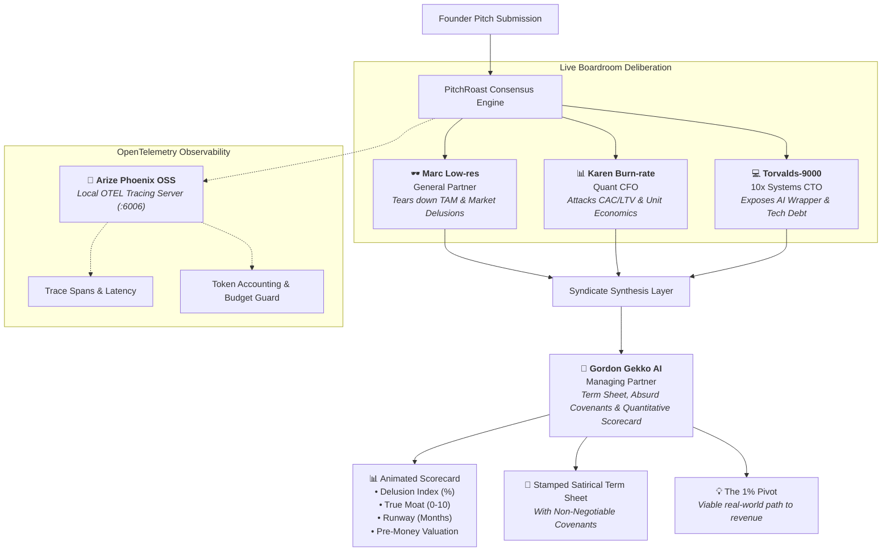

# PitchRoast 🔥 — Technical & Design Specification

> **Event**: Stockholm | Fable 5.1 x Opus 5.5 Build Day @ Epicenter  
> **Tracks**: Track 1 — Delight & Track 2 — Breakthrough  
> **Tagline**: *"The Autonomous Venture Committee of 4 ruthless AI partners who debate, dismantle, and deliver the brutal truth no VC says to your face—complete with live agent banter, animated scorecard, and a satirical term sheet."*

---

## 1. 🏛️ Architecture & Autonomous Multi-Agent Topology

PitchRoast replaces polite diplomatic investor rejection emails with an autonomous, high-speed investment committee debate:

### The Committee Partners

| Partner | Persona Title | Focus Domain | Architectural Role |
| :--- | :--- | :--- | :--- |
| **🕶️ Marc Low-res** | General Partner | TAM delusions, buzzword soup, market reality | Attacks founder pitch assumptions and fake moats |
| **📊 Karen Burn-rate** | Quant CFO | Unit economics, CAC > LTV, negative margins | Computes financial burn and cash crunch runway |
| **💻 Torvalds-9000** | 10x Systems CTO | AI wrappers, single-point failures, latency | Technical architecture dissection and tech debt |
| **🦈 Gordon Gekko AI** | Syndicate Shark | Term sheet, valuation haircut, covenants | Delivers the binding contract and final quantitative verdict |

---

## 2. 🎨 UI/UX & Animation Specification

### Design Principles
* **Dark Glassmorphism**: Translucent card layers (`rgba(30, 41, 59, 0.7)` with `backdrop-filter: blur(12px)`) over deep space background.
* **Warm Fire Gradient Accent**: Signature gradient (`#FF4500` Flame to `#FF8C00` Amber to `#FFD700` Gold).
* **Kinetic Micro-Interactions**:
  - `pulseGlow`: Hero banner emits a soft pulsing orange glow simulating an active boardroom furnace.
  - `flameFlicker`: The fire icon rotates and scales dynamically.
  - `ledBlink`: Real-time status indicators blink green (`#10B981`) to signify active model consensus.
  - `slideUpFade`: Deliberation cards smoothly transition into view when generated.
  - `hoverElevation`: Partner cards elevate (`translateY(-4px)`) on hover with warm glow borders.
* **Stamped Syndicate Verdict**: Term sheets feature a tilted, distressed red stamp badge (`❌ REJECTED BY SYNDICATE`) with red neon border glow.

---

## 3. 🤖 Frontier Model Strategy & Credit Budgeting

The system targets Anthropic's event-provisioned models with automated cost management:

* **⚡ `claude-fable-5-1` (Default / Development Mode)**:
  - Direct token output without extended reasoning overhead.
  - Latency: ~2.5–4.5s.
  - Ideal for rapid prompt tweaking, preset tests, and conserving the 100€ credits.
* **🧠 `claude-opus-5-5` (Stage Demo Mode)**:
  - Activates extended thinking blocks (`ThinkingBlock`).
  - Automatically isolates thinking tokens into an expandable deliberation drawer (`🧠 VC Partner Deliberation`).
  - Maximum wit, deep financial dissection, and satirical punch.
* **Telemetry Accounting**:
  - Real-time display of input tokens, output tokens, and model identifier after each execution.

---

## 4. 🔭 Observability Specification (Arize Phoenix OSS)

* **Architecture**: OpenInference auto-instrumentation wrapped around Anthropic client SDK (`openinference-instrumentation-anthropic`).
* **Zero Credit Overhead**: Runs as an in-process daemon on `http://localhost:6006` on the local machine.
* **Observed Metrics**:
  - Latency per message generation.
  - Exact token usage breakdown (prompt tokens, completion tokens).
  - OpenTelemetry span hierarchy.
  - Prompt payloads and JSON response fidelity.

---

## 5. 🎤 2-Minute Stage Pitch Playbook (20:30 at Epicenter)

* **0:00 - 0:25 (The Problem Hook)**:
  > *"Every founder in this room has pitched an investor and received the standard diplomatic reply: 'Great deck, let's keep in touch!' That's VC code for: 'This makes zero sense.' We built PitchRoast to eliminate polite lies."*
* **0:25 - 1:15 (The Live Demo)**:
  > Select preset: *'Autonomous Oat Milk Micro-Roastery with Web3 Proof-of-Foam'*.  
  > Click **🚀 Convene Committee**.  
  > Watch the animated scorecards light up (Delusion Index: 94%, Valuation: $11.80 and a lukewarm latte).  
  > Read Marc's roast: *"Your TAM includes tap water, Capri Sun, and every drink at Little League."*  
  > Read Torvalds' roast: *"You cannot roast milk. That is a thermodynamic fact."*  
  > Point out the stamped Term Sheet and absurd covenants.
* **1:15 - 1:40 (The Tech & Observability)**:
  > Show the multi-agent consensus architecture powered by Claude Fable 5.1 and Opus 5.5.  
  > Switch tabs to `localhost:6006` to flash the live Arize Phoenix OpenTelemetry tracing dashboard.
* **1:40 - 2:00 (Closing Punchline)**:
  > *"PitchRoast: The honest VC that costs \$0 instead of 20% of your equity. Thank you!"*
