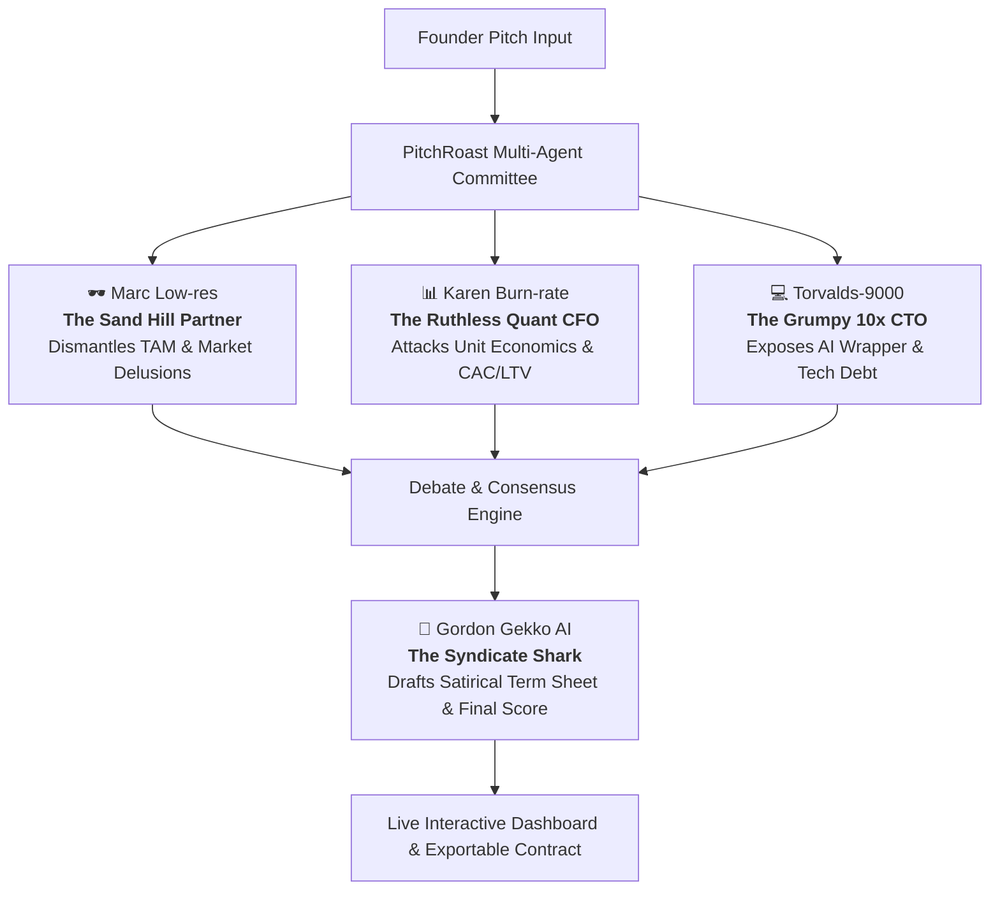

# PitchRoast 🔥 — Multi-Agent Venture Syndicate

> **Track**: Track 1 — Delight & Track 2 — Breakthrough  
> **Pitch**: *"An autonomous venture syndicate of 4 ruthless AI partners who debate, dismantle, and deliver the brutal truth no VC says to your face—complete with live agent banter and a satirical term sheet."*

---

## 🏛️ Multi-Agent Architecture

Rather than a single prompt, **PitchRoast** deploys an autonomous investment committee:

### The 4 Syndicate Agents

1. **🕶️ The Sand Hill Partner ("Marc Low-res")**
   - **Role**: General Partner / Ideology Critic.
   - **Focus**: Market size delusions, "we have no competitors", buzzword soup, fake moats.
   - **Tone**: Hyper-cynical, drops name of non-existent podcasts, references burning $20M in 2021.

2. **📊 The Ruthless Quant CFO ("Karen Burn-rate")**
   - **Role**: Head of Portfolio Financials.
   - **Focus**: Negative gross margins, CAC > LTV, cloud bills, running out of money in 47 days.
   - **Tone**: Ice cold, numbers-driven, allergic to "unmonetized user engagement".

3. **💻 The Grumpy 10x CTO ("Torvalds-9000")**
   - **Role**: Technical Partner & Code Architect.
   - **Focus**: "You're literally an OpenAI API call wrapped in Tailwind", technical debt, latency, hallucination risks.
   - **Tone**: Exhausted senior engineer who has rewritten your stack in Rust during the meeting.

4. **🦈 The Syndicate Shark ("Gordon Gekko AI")**
   - **Role**: Managing Partner & Lead Negotiator.
   - **Focus**: Valuation haircut (95%), 5x participating preferred liquidation, founder dilution, absurd covenants.
   - **Tone**: Ruthless dealmaker who presents the contract you must sign.

---

## 📊 Live Metrics & Scoring System

The syndicate computes 4 quantitative indices:
1. **Delusion Index** (0 - 100%): How divorced from reality is the pitch?
2. **True Moat Score** (0 - 10/10): How easily could a college student copy this this weekend?
3. **Runway Probability** (0 - 100%): Odds of surviving 12 months without emergency down-round.
4. **Venture Capitalist BS Resistance** (0 - 10/10): Ability to withstand basic due diligence.

---

## 🚀 2-Minute Presentation Flow (20:30 at Epicenter)

* **0:00 - 0:25 (The Problem)**: Every founder gets ghosted or fed diplomatic platitudes ("Let's stay in touch!"). PitchRoast gives you the unvarnished truth before you burn two years and your savings.
* **0:25 - 1:25 (Live Multi-Agent Demo)**:
  - Submit a startup idea on screen.
  - Watch the 3 partners debate live in parallel streams:
    - Marc attacks the market assumption.
    - Karen shreds the unit economics.
    - Torvalds calls out the API wrapper.
  - Shark enters to summarize the verdict and present the satirical term sheet.
* **1:25 - 1:45 (Tech Innovation)**:
  - Multi-agent persona prompting powered by Claude 3.5 Sonnet / Opus 5.5 / Fable 5.1.
  - Parallel orchestration with streaming UI cards.
  - Instant downloadable markdown/contract.
* **1:45 - 2:00 (The Closing Punchline)**: *"PitchRoast: The honest VC that costs \$0 instead of 20% of your company."*
